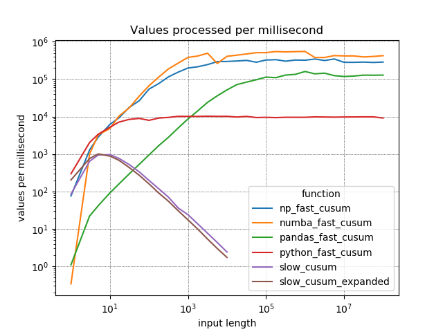

# Fast Python
Source code for Fast Python (2020) by Chris Conlan

Paperback available for purchase [on Amazon](https://amzn.to/2XmvJ3x).

---------------

#### Code profiles

The following code profiles can be run as stand-alone scripts. They may or may not depend on explanation provided in the accompanying book.

+ Binary search: [binary_search.py](src/binary_search.py)
+ Dictionary construction: [build_dict.py](src/build_dict.py)
+ Concatenating strings, string construction: [concatenate_strings.py](src/concatenate_strings.py)
+ Counting the frequency of a value: [count_occurrences.py](src/count_occurrences.py)
+ Computing a cumulative sum: [cumulative_sum.py](src/cumulative_sum.py)
+ The `in` operator and early stopping: [early_stopping.py](src/early_stopping.py)
+ Time series filters/convolutions: [filters.py](src/filters.py)
+ Find largest `k` values in a list: [find_top_k.py](src/find_top_k.py)
+ List construction/declaration/flattening: [flatten_lists.py](src/flatten_lists.py)
+ Counting lines in a file: [line_count.py](src/line_count.py)
+ Set intersection, finding matches in a list: [match_within.py](src/match_within.py)
+ Matrix multiplication: [matrix_multiplication.py](src/matrix_multiplication.py)
+ Computing moving averages: [moving_averages.py](src/moving_averages.py)
+ Counting frequency of a word in text: [occurrences_of.py](src/occurrences_of.py)
+ Looping through `pd.DataFrame` objects: [pandas_loops.py](src/pandas_loops.py)
+ Sorting algorithms: [sorting.py](src/sorting.py)
+ Low-level sorting algorithms: [sorting_v2.py](src/sorting_v2.py)
+ Adding a list of numbers: [sum.py](src/sum.py)

Running them is simple ...

```
cd fast-python/src
python cumulative_sum.py
```

-----------

#### Profiling

All the profiles use a simple profiling module in [src/utils/profiler.py](src/utils/profiler.py). It produces tables and charts like the following.




```
np_fast_cusum
    n   = 56234132 values
    t   = 201.806 ms
    n/t = 278653.8114 values per ms

np_fast_cusum
    n   = 100000000 values
    t   = 350.611 ms
    n/t = 285216.7553 values per ms

...

                function   n_values  t_milliseconds  values_per_ms
0             slow_cusum          1           0.012        85.0196
1             slow_cusum          3           0.005       640.7530
...
14            slow_cusum       5623        1298.218         4.3313
15            slow_cusum      10000        4140.327         2.4153
...
30   slow_cusum_expanded       5623        1878.419         2.9935
31   slow_cusum_expanded      10000        5767.316         1.7339
...
62     python_fast_cusum   56234132        5727.162      9818.8478
63     python_fast_cusum  100000000       10939.993      9140.7733
...
94     pandas_fast_cusum   56234132         442.652    127039.2437
95     pandas_fast_cusum  100000000         780.461    128129.3962
...
126     numba_fast_cusum   56234132         139.602    402816.3295
127     numba_fast_cusum  100000000         236.445    422930.9936
...
158        np_fast_cusum   56234132         201.806    278653.8114
159        np_fast_cusum  100000000         350.611    285216.7553

```

I use the profiler frequently in my own work. It allows me to analyze the relationship between computational complexity and raw execution time pretty easily.

-----------------

#### Dependencies

I have included a `dependencies.txt`, but you should be fine with a blank Python 3 environment followed by ...

```
pip install numpy pandas numba joblib matplotlib pillow
```

----


